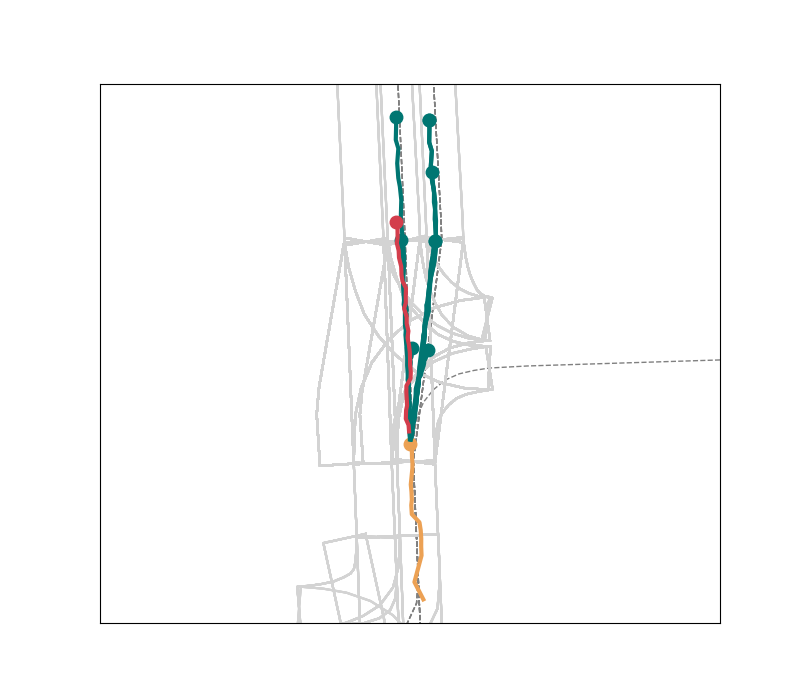
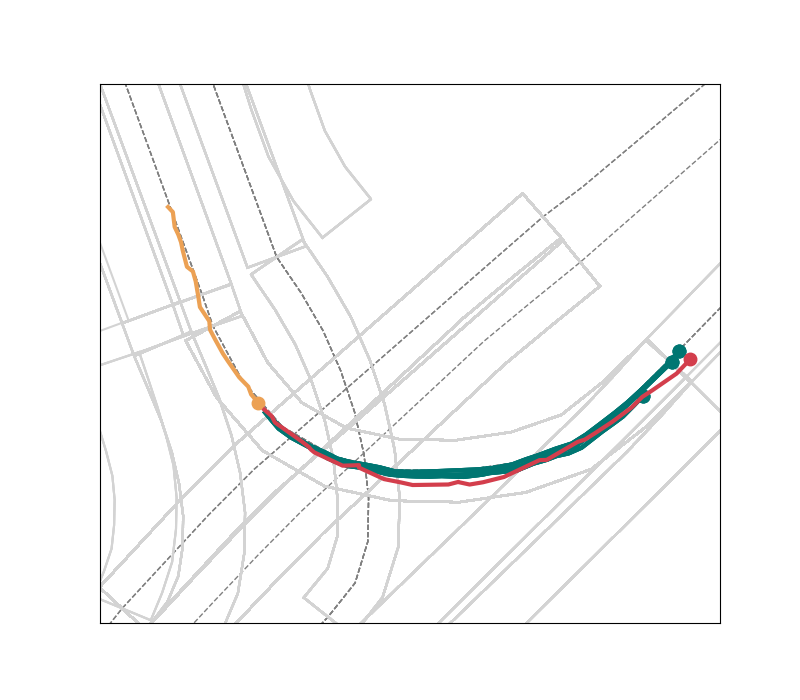
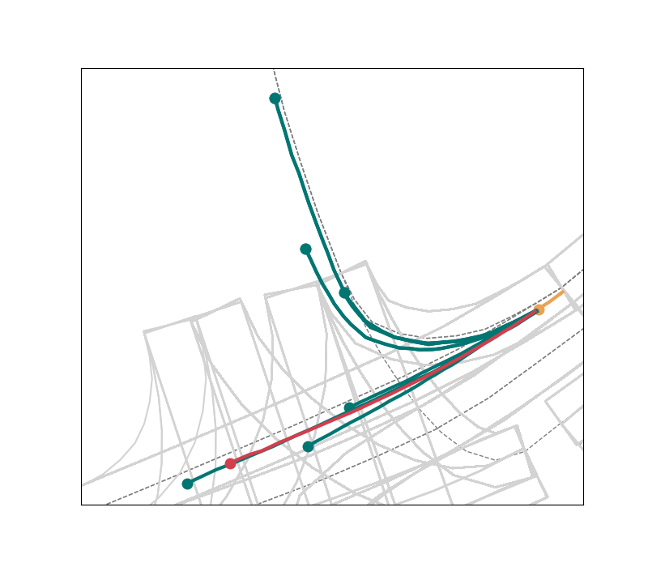
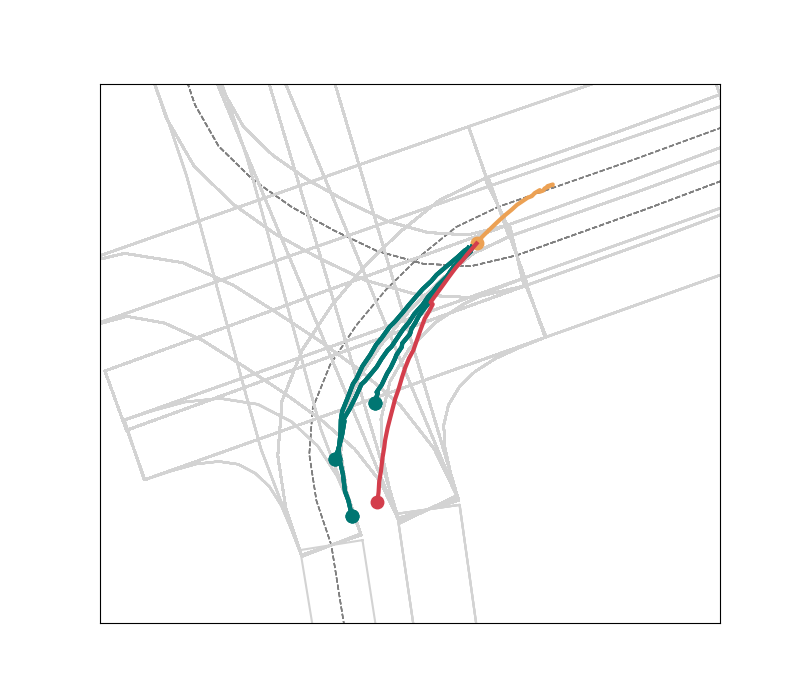

[](https://www.python.org/downloads/release/python-370/)


# Argoverse Motion Forecasting Baselines

> Official GitHub repository for [Argoverse](https://www.argoverse.org) Motion Forecasting Baselines. This repository is released under **BSD-3-Clause-Clear License**.

---

## Table of Contents

> If you have any questions, feel free to open a [GitHub issue](https://github.com/jagjeet-singh/argoverse-forecasting/issues) describing the problem.

- [Installation](#installation)
- [Usage](#usage)
- [Contributing](#contributing)
- [License](#license)

---

## Installation

Requires Linux, git, and Python 3.6+

### 1) Setup Argoverse API

Follow instructions on Argoverse [repository](https://github.com/argoai/argoverse-api.git)
to setup Argoverse API. Make sure the map files are downloaded to the root directory of argoverse repo.

### 2) Download Argoverse-Forecasting

Argoverse provides both the full dataset and the sample version of the dataset for testing purposes. Head to [their website](https://www.argoverse.org/data.html#download-link) to see the download option.

### 3) Install dependencies
Install the packages mentioned in `requirements.txt`
```
pip install -r requirements.txt
```
---

## Usage
Running Motion Forecasting baselines has the below 3 components. The runtimes observed on a `p2.8xlarge` instance (8 NVIDIA K80 GPUs, 32 vCPUs and 488 GiB RAM) are also provided for each part:

### 1) Feature computation (`compute_features.py`)

To begin with, we need to compute social and map features for train, val and test set. This is the most computationally expensive part.

Run the following script to compute features for each of train/val/test.
```
$ python compute_features.py --data_dir <path/to/data> --feature_dir <directory/where/features/to/be/saved> --mode <train/val/test> --obs_len 20 --pred_len 30
```
| Component | Mode | Runtime |
| --- | --- | --- |
| Feature computation (`compute_features.py`) | train | 38 hrs |
| Feature computation (`compute_features.py`) | val | 7 hrs |
| Feature computation (`compute_features.py`) | test | 14 hrs |


*Note*: If you are not changing anything in the feature computation step, you can also download the precomputed features from [this](https://www.google.com/url?q=https://drive.google.com/drive/folders/1hHbpdlsgQL_XOxrUK0OuWGX0BxiGpxKY?usp%3Dsharing&sa=D&source=hangouts&ust=1572986070601000&usg=AFQjCNFZPWA9Z17Oi1bf3HAmMwKhRgRM_Q) link

### 2) Run forecasting baselines (`nn_train_test.py`, `lstm_train_test.py`)

Once the features have been computed, we can run any of the below baselines. 

#### Constant Velocity:

```
$ python const_vel_train_test.py --test_features <path/to/test/features> --obs_len 20 --pred_len 30 --traj_save_path <pkl/file/for/forecasted/trajectories>
```

| Component | Mode | Runtime |
| --- | --- | --- |
| Constant Velocity (`const_vel_train_test.py`) | train+test | less than 1 min |


#### K-Nearest Neighbors:

Using Map prior:
```
$ python nn_train_test.py --train_features <path/to/train/features> --val_features <path/to/val/features> --test_features <path/to/test/features> --use_map --use_delta --obs_len 20 --pred_len 30 --n_neigh 3 --model_path <pkl/file/path/for/model> --traj_save_path <pkl/file/for/forecasted/trajectories>
```

Neither map nor social:
```
$ python nn_train_test.py --train_features <path/to/train/features> --val_features <path/to/val/features> --test_features <path/to/test/features> --normalize --use_delta --obs_len 20 --pred_len 30 --n_neigh 9 --model_path <pkl/file/path/for/model> --traj_save_path <pkl/file/for/forecasted/trajectories>
```

| Component | Mode | Baseline | Runtime |
| --- | --- | --- | --- |
| K-Nearest Neighbors (`nn_train_test.py`) | train+test | Map prior | 3.2 hrs |
| K-Nearest Neighbors (`nn_train_test.py`) | train+test | Niether map nor social | 0.5 hrs | 

#### LSTM:

Using Map prior:
```
$ python lstm_train_test.py --train_features <path/to/train/features> --val_features <path/to/val/features> --test_features <path/to/test/features> --model_path <path/to/saved/checkpoint> --use_map --use_delta --obs_len 20 --pred_len 30 --traj_save_path <pkl/file/for/forecasted/trajectories>
```

Using Social features:
```
$ python lstm_train_test.py --train_features <path/to/train/features> --val_features <path/to/val/features> --test_features <path/to/test/features> --model_path <path/to/saved/checkpoint> --use_social --use_delta --normalize --obs_len 20 --pred_len 30  --traj_save_path <pkl/file/for/forecasted/trajectories>
```

Neither map nor social:
```
$ python lstm_train_test.py --train_features <path/to/train/features> --val_features <path/to/val/features> --test_features <path/to/test/features> --model_path <path/to/saved/checkpoint> --use_delta --normalize --obs_len 20 --pred_len 30 --model_path <pkl/file/path/for/model> --traj_save_path <pkl/file/for/forecasted/trajectories>
```

| Component | Mode | Baseline | Runtime |
| --- | --- | --- | --- |
| LSTM (`lstm_train_test.py`) | train | Map prior | 2 hrs |
| LSTM (`lstm_train_test.py`) | test | Map prior | 1.5 hrs |
| LSTM (`lstm_train_test.py`) | train | Social | 5.5 hrs |
| LSTM (`lstm_train_test.py`) | test | Social | 0.1 hr |
| LSTM (`lstm_train_test.py`) | train | Neither Social nor Map | 5.5 hrs |
| LSTM (`lstm_train_test.py`) | test | Neither Social nor Map | 0.1 hr |
---

### 3) Metrics and visualization

#### Evaluation metrics

Here we compute the metric values for the given trajectories. Since ground truth trajectories for the test set have not been released, you can run the evaluation on the val set. If doing so, make sure you don't train any of the above baselines on val set.

Some examples:

Evaluating a baseline that didn't use map and allowing 6 guesses
```
python eval_forecasting_helper.py --metrics --gt <path/to/ground/truth/pkl/file> --forecast <path/to/forecasted/trajectories/pkl/file> --horizon 30 --obs_len 20 --miss_threshold 2 --features <path/to/test/features> --max_n_guesses 6
```

Evaluating a baseline that used map prior and allowing 1 guesses along each of the 9 centerlines
```
python eval_forecasting_helper.py --metrics --gt <path/to/ground/truth/pkl/file> --forecast <path/to/forecasted/trajectories/pkl/file> --horizon 30 --obs_len 20 --miss_threshold 2 --features <path/to/test/features> --n_guesses_cl 1 --n_cl 9 --max_neighbors_cl 3
```

Evaluating a K-NN baseline that can use map for pruning and allowing 6 guesses
```
python eval_forecasting_helper.py --metrics --gt <path/to/ground/truth/pkl/file> --forecast <path/to/forecasted/trajectories/pkl/file> --horizon 30 --obs_len 20 --miss_threshold 2 --features <path/to/test/features> --prune_n_guesses 6
```

It will print out something like
```
------------------------------------------------
Prediction Horizon : 30, Max #guesses (K): 1
------------------------------------------------
minADE: 3.533317191869932
minFDE: 7.887520305278937
DAC: 0.8857479236783845
Miss Rate: 0.9290787402582446
------------------------------------------------
```

#### Visualization

Here we visualize the forecasted trajectories

```
python eval_forecasting_helper.py --viz --gt <path/to/ground/truth/pkl/file> --forecast <path/to/forecasted/trajectories/pkl/file> --horizon 30 --obs_len 20 --features <path/to/test/features>
```
Some sample results are shown below

| | |
|:-------------------------:|:-------------------------:|
|  |  |
|  |  |


---

## Contributing
Contributions are always welcome! Please be aware of our [contribution guidelines for this project](CONTRIBUTING.md).

---

## License

The repository is released under **BSD-3-Clause-Clear License**. Please be aware of the constraints. See **[LICENSE](./LICENSE)**
